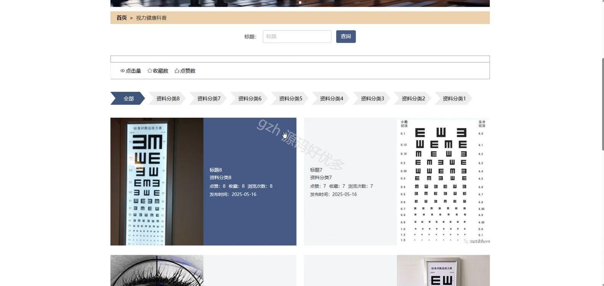

# springbootA394D
springbootA394D基于SpringBoot的学生视力健康管理系统
## 查看主页获取源码

### 一、关键词

视力报告、视力检测、视力健康科普

 

### 二、作品包含

源码+数据库+全套环境和工具资源+部署教程

 

### 三、项目技术

前端技术：Html、Css、Js、Vue2.0、Element-ui 
后端技术：Java、SpringBoot2.0、MyBatis

  

 

### 四、运行环境（以下版本亲测，其他版本未知，请自测）

开发工具：IDEA/eclipse  + VSCODE

数据库：MySQL5.7（最低要5.7版本）

数据库管理工具：Navicat10以上版本

环境配置软件： JDK1.8 + Maven3.6.3

前端Nodejs：14

浏览器：谷歌浏览器

 

### 五、项目介绍

项目编号：springbootA394D

学生视力健康管理系统通过管理，实现学生视力状况的全周期管理，助力预防近视及视力保护。

角色：管理员、用户

管理员功能：系统首页、学生、资料分类、视力健康科普、视力报告、异常预警通知、视力检测结果、弹窗提醒、系统管理、我的。

用户功能：首页、视力健康科普、公告信息、个人中心、修改密码、视力报告、异常预警通知、我的收藏。

 

### 六、运行截图

